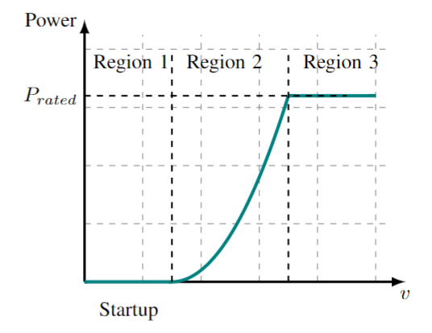

# Multi-agent Inductive Policy Optimization

This repo is the code implementation of the paper titled "Multi-agent Inductive Policy Optimization" (MAIPO). In this paper, a novel multi-agent reinforcement learning algorithms is proposed and this repo contains all details of MAIPO.

## Dependency

1. Python3 (include numpy, tensorflow1.0 etc.)
2. [Pettingzoo]([GitHub - Farama-Foundation/PettingZoo: Gym for multi-agent reinforcement learning](https://github.com/Farama-Foundation/PettingZoo))
3. [FAST.Farm]([GitHub - OpenFAST/openfast: Main repository for the NREL-supported OpenFAST whole-turbine and FAST.Farm wind farm simulation codes.](https://github.com/OpenFAST/openfast))

## How to run the code

```
python3 ./run.sh > run.log 2>&1 &
```

Please use the following command to see other input parameters of the train.py file.

```
python3 train.py --help
```

# MRRL-based wind farm control tasks (For Reviewers)

This section first introduce how we control a wind farm and the wind farm simulator we used. Then a traditional wind farm control method---MPPT is introduced as a baseline.  Afterward, we will evaluate the proposed MAIPO algorithm on this simulator and show the comparison with  HAPPO, MAPPO, MPPT etc. Finally, we will exhibit how the control policies trained by MARL overcome the wake effect in wind farms and boost their power generation. These results will be added in the appendix of the corresponding paper. 

## Introduction of the wind farm control task

A wind turbine control system consists of sensors, actuators, and a system that ties these elements together. A hardware or software system processes input signals from the sensors and generates output signals for actuators. The main goal of the controller is to modify the operating states of the turbine to maintain safe turbine operation, maximize power, mitigate damaging fatigue loads, and detect fault conditions. In this paper, our goal is to collectively control different substructures of wind turbines to maximize the power generated by the entire wind farm, including blade pitch control, nacelle yaw control, generator torque control etc. The blade pitch and nacelle yaw are shown in the following figure:


Roughly, the output power of a wind turbine can be determined by its yaw angle, pitch angle and generator torque: $P = fun(\phi, \beta, T_g)$, where $\phi$ is the yaw angle, $\beta$ is the pitch angle and $T_g$ is the generator torque, $fun$ is the environmental model. So the pitch, yaw, and generator troque can be actions for RL agents. And the state can be the wind field around the turbine. The reward function is proportional to the power generation $r= k*P$. 

## The wind farm simulator

The wind farm simulator we used in this paper is FAST.Farm, it serves as the real-time digital counterpart of a physical wind farm. This simulator both include models of the aerodynamics of the wind farm and the elastic-servo dynamics of wind turbines. Different from the traditional control methods that use the wind farm model to design the control policy, MARL aims to teach each agent (turbine) to learn the control policy through interacting with the simulator. Specifically, at time $t$, MARL agents use the control policy $\pi_t$ to generate action references (e.g. pitch and torque) $a_t$ for wind turbines based on the current state $s_t$ of the simulator. Then, the actuators execute their actions while imposing a thrust force on the wind farm. The farm simulator shifts the next state $s_{t+1}$ by calculating this force while feeding back a reward $r$ to agents. MARL leverages this reward to train the control policy of each agent, and then the agent uses the trained policy $\pi_{t+1}$ to generate action references at $s_{t+1}$. The interaction between agents and the simulator continues until the control policy converges to an excellent solution. Through the entire training process, the MARL agents only use samples collected from the interaction with the simulator to learn the control policy, rather than acquiring any information about the model of the wind  farm.


## Maximal Power Point Tracking (MPPT)- a classical control method for wind turbines

The optimal control policy for an isolated wind turbine is maximum power point tracking (MPPT): 



when the wind speed is below rated, the objective is to control the generator torque to maximize its power output. When the wind speed is sufficient to drive the full-power operation of wind turbines, the goal becomes to maintain the output at the rated level to alleviate the structural load via the joint control of blade pitch, yaw angle, and generator torque. In wind farms, turbines are normally installed in arrays, and thus the actions of upstream turbines affect the environmental state of their downstream counterparts through the wake effect. Although MPPT can achieve optimal solutions for upstream turbines, the power outputs of HWTs within the wake planes of upstream turbines are reduced greatly, causing a decline in power generation of the entire wind farm. Therefore, how to design a control policy for wind farms which can overcome the wake effect is an ongoing issue. This paper proposes MAIPO to solve this problem.


## Simulation results and comparison

### Environment setup

|              | Experment 1 | Experiment 2 | Experiment 3 | Experiment 4 |
| ------------ | ----------- | ------------ | ------------ | ------------ |
| Turbine Type | NREL 5MW    | SOWFA        | Palm         | CLwind       |
| Numbers      | 9           | 9            | 6            | 2            |
| Power Scale  | 0.99        | 0.99         | 0.99         | 0.99         |
| Rotor length | 126         | 96           | 81           | 60           |

 

### Results

Experiment 1


Experiment 2


Experiment 3


Experiment 4


### The dynamical process which MARL control policy overcome the wake effect

#### MPPT control 

                           


#### MARL (MAIPO) control


## Additional results in MPE

We reproduce HAPPO and compare it with MAIPO. From the following results, we can find the performance of MAIPO is better than HAPPO. 


### MPE-Reference


### MPE-Speaker_Listener


### MPE-Spread


